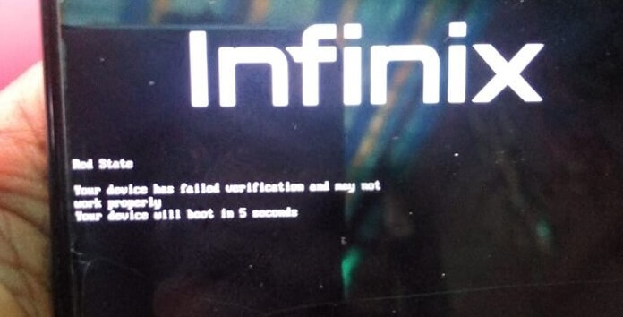

# <div align="center" >OmniPatch X663 <br> <i> Fixing BPF Network & Bootloader Warnings </i> </div>

This repository provides a critical solution for the **Infinix Note 11 (X663)** device when running GSI (Generic System Image) builds, specifically addressing the issue of **WiFi - Mobile Data not working** on **Android 14 and higher**, as well as removing the unlocked bootloader warnings.

<div align="center" display: flex;>


</div>
<br>

This release provides the necessary patched boot image to enable Mobile Data (Internet) functionality on Generic System Images (GSIs) running Android 14 or higher on the Infinix Note 11 (X663), and a patched LK image to remove boot warnings.

---

## **Included Files & Details**

### 1. `stock_boot.img` (Reference)
* **Description:** The original, unpatched boot image extracted directly from the official Stock ROM.
* **Stock ROM Source:** ```X663-H6915ABCEFGHIO-S-GL-230113V402```(Android 12 Base).
* **Purpose:** Included for reference or if you need to restore your device's original boot state.

⚠️ **WARNING:** If you are unsure of what you are doing, flashing the wrong boot image can soft-brick your device's software! Proceed with caution and if anything bricks it's your responsibility.

### 2. `patched_boot_bpf_fix.img` (Ready-to-Use)
* **Description:** This is the modified boot image with the essential BPF (Berkeley Packet Filter) kernel patch applied. This patch is mandatory for network connectivity on many modern MTK GSIs.
* **Status:** Ready for use.
* **Tested GSI Versions:** Successfully tested and confirmed working with GSI versions up to Android 16. Mobile data connectivity is functional.
* **Usage:** Flash this file via Fastboot (refer to the instructions below).

**Key Fixes:**
* Enables WiFi - Mobile Data on Android 14+ GSIs for the X663.
* Utilizes the `mtk-bpf-patcher` for stability.

### 3. `lk-patched.img` (Boot Warning Fix)
* **Description:** Patched Little Kernel (LK) image.
* **Purpose:** Removes all "Orange State" and unlocked bootloader warnings when booting the device.

<div align="center">

</div>

---

## **The Problem & Solution**

When flashing any modern GSI (e.g., AOSP A15 or DerpFest A16) on the Infinix Note 11 (X663), the device boots correctly, but **WiFi - Mobile Data fails to work entirely BUT If we started HOTSPOT Sharing ... the other device can connect to our internet normally**. This is a known issue on many MediaTek devices and requires a specific patch to the kernel within the `boot.img` to enable the necessary BPF layer for network function.

### **Quick Fix (Try this first)**
Before flashing, try this ADB command. If it works, you don't need the patched boot image:
```bash
adb shell settings put global restricted_networking_mode 0
```

---

## **Flashing Instructions**

⚠️ **WARNING:** Flashing custom images carries inherent risks. I am not responsible for any damage to your device. Ensure your device is the **Infinix Note 11 (X663)** and you have Fastboot/ADB access.

### **Prerequisites**
1.  ADB/Fastboot binaries and drivers installed on your PC.
2.  Your device's **Bootloader must be unlocked**.
3.  A GSI (Android 14 or higher) must already be installed.

### **Steps**
1.  Download the **`patched_boot_bpf_fix.img`** and **`lk-patched.img`** files to an easily accessible folder on your computer.
2.  Open Command Prompt or PowerShell in your ADB/Fastboot directory.
3.  Verify your device is connected:
    ```bash
    adb devices
    ```
4.  Restart to bootloader:
    ```bash
    adb reboot bootloader  
    ```

**Flashing the LK Image (Removes Boot Warnings):**
*Note: Make sure you are in normal bootloader mode, not fastbootd.*
```bash
fastboot flash lk lk-patched.img
```

**Flashing the Boot Image (Fixes WiFi/Mobile Data):**

5. Enter fastbootd Mode (Recommended for boot image):
```bash
fastboot reboot fastboot 
```
6. Flash the patched boot image:
```bash
fastboot flash boot patched_boot_bpf_fix.img
```
7.  Once all flashing is complete, reboot your device:
```bash
fastboot reboot
```

**Result:** WiFi - Mobile Data connectivity should now be correctly enabled on your installed GSI, and the bootloader unlocked warnings will be gone!

---

## **Credits and Acknowledgements**

A special thanks to the communities and developers who make these fixes possible:

* **[`MedoX71T`](https://t.me/MedoX71T) - (ME)**: For the testing, patching, and providing these files.
* **R0rt1z2**: For developing the essential [`mtk-bpf-patcher`](https://github.com/R0rt1z2/mtk-bpf-patcher) tool.
* The wider **XDA and Project Treble communities** for continuous support and research.

Please report any issues or submit improvements by opening a new "Issue" in this repository.
